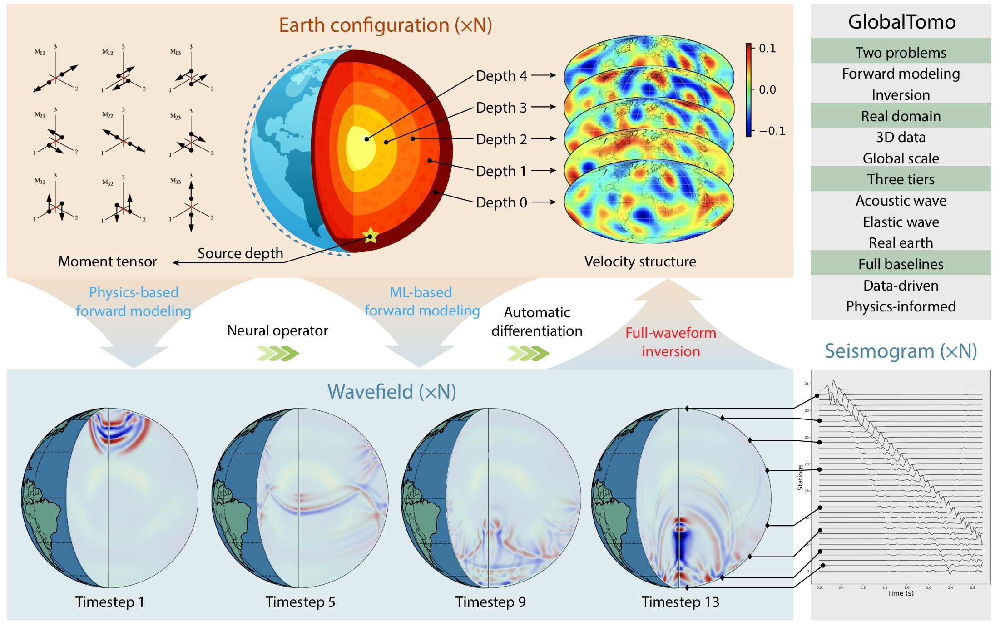
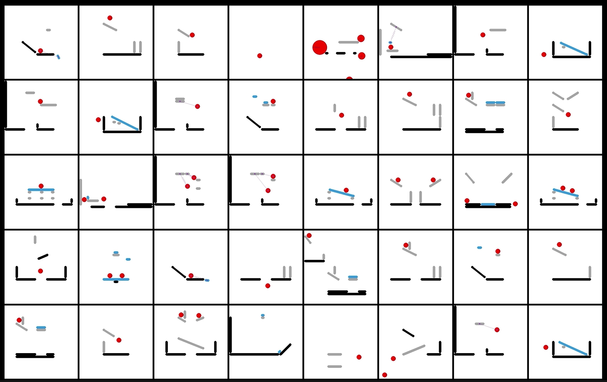
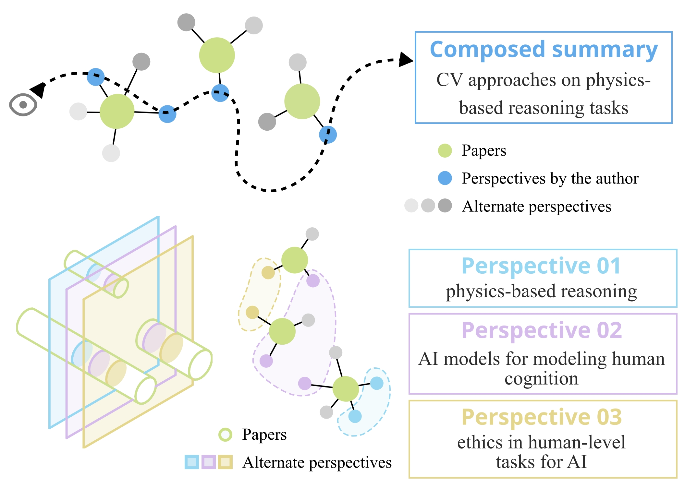
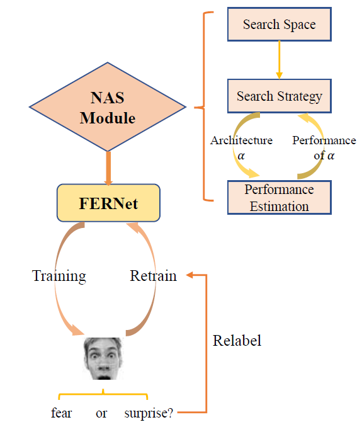
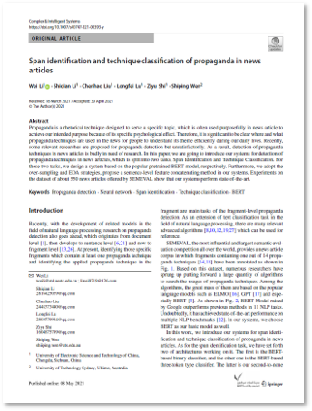

# About Me

**I'm now a Ph.D. student at *School of Artificial Intelligence, Peking University* under the supervision of [Dr. Yixin-Zhu](https://yzhu.io). My goal is to build intelligent agents that can understand, predict, and interact with the physical world. Always ready to share ideas!**

# News! 
* **One paper accepted in ICLR 2024.**
* **One paper accepted in ACL 2023.**
* **Receive a NeurIPS 2022 Scholar Award.**
* **One paper accepted in NeurIPS 2022 (Spotlight).**
* **I won The Most Outstanding Students Award of UESTC.**

# Interests

**My research interests include**

* **Cognitive Reasoning**: Intuitive Physics, Physical Reasoning
* **AI for Physics**: Seismic Modeling, Inverse Problems
* **Auto-ML**: Neural Architecture Search

# Education

### - Ph.D. in Intelligent Science and Technology
#### _2022/09-2027/06 (expected)_
  * **Peking University, Beijing**

### - Bachelor of Data Science and Big Data Technology
#### _2018/09-2022/06_
  * **University of Electronic Science and Technology of China, Chengdu**

# Blog
I record technical notes, research projects, and life experiences in my [blog](https://blog-shiqian.vercel.app/). I am also running a [reading list](https://github.com/lishiqianhugh/Intuitive_Physics_Reading_List) to facilitate knowledge sharing in the community of intuitive physics. Welcome to contribute!

# Publications

<table border="2">
  <tr>
    <td width="75%">
       
<b>Neural Force Field: Learning Generalized Physical Representation from a Few Examples</b>

       
<small><b>Shiqian Li*</b>, Ruihong Shen*, Chi Zhang, Yixin Zhu </small>

       
<small><b>arxiv, 2025</b></small>

       <a href="https://arxiv.org/pdf/2502.08987">[Paper]</a>
       <a href="https://neuralforcefield.github.io/">[Web]</a>
       <a href="https://github.com/lishiqianhugh/NeuralForceField">[Code]</a>
       <a href="https://vimeo.com/1055247476">[Video]</a>
       <a href="https://drive.google.com/file/d/1n5P7RiK1V7LxRJW8mvLL-QeDzHF7d75O/view">[Dataset]</a>
    </td>
    <td width="25%">
      <video controls autoplay muted loop style="width: 100%; height: auto;">
          <source src="figures/more_step_hole_1.mp4" type="video/mp4">
          Your browser does not support the video tag.
      </video>
    </td>
  </tr>
</table>

<table border="2">
  <tr>
    <td width="75%">
       
<b>GlobalTomo: A global dataset for physics-ML seismic wavefield modeling and FWI</b>

       
<small><b>Shiqian Li*</b>, Zhi Li*, Zhancun Mu, Shji Xin, Zhixiang Dai, Kuangdai Leng, Ruihua Zhang, Xiaodong Song, Yixin Zhu </small>

       
<small><b>arxiv, 2025</b></small>

       <a href="https://arxiv.org/pdf/2406.18202v2">[Paper]</a>
       <a href="https://global-tomo.github.io/">[Web]</a>
       <a href="https://github.com/lishiqianhugh/GlobalTomo">[Code]</a>
       <a href="https://vimeo.com/957588046">[Video]</a>
       <a href="https://huggingface.co/datasets/lishiqianhugh/globaltomo">[Dataset]</a>
    </td>
    <td width="25%">
      
    </td>
  </tr>
</table>

<table border="2">
  <tr>
    <td width="75%">
       
<b>I-PHYRE: Interactive Physical Reasoning</b>

       
<small><b>Shiqian Li</b>, Kewen Wu, Chi Zhang, Yixin Zhu </small>

       
<small><b>ICLR, 2024</b></small>

       <a href="https://arxiv.org/abs/2312.03009">[Paper]</a>
       <a href="https://lishiqianhugh.github.io/IPHYRE">[Web]</a>
       <a href="https://github.com/lishiqianhugh/IPHYRE">[Code]</a>
       <a href="https://vimeo.com/793260764/2f77f9d5cb">[Video]</a>
       <a href="https://yzhu.io/publication/intuitive2024iclr/poster.pdf">[Poster]</a>
       <a href="https://mp.weixin.qq.com/s/QRIgozzM4rYDfqel3Pme-Q">[北大AI院推文]</a>
    </td>
    <td width="25%">
      
    </td>
  </tr>
</table>

<table border="2">
  <tr>
    <td width="75%">
       
<b>PersLEARN: Research Training through the Lens of Perspective Cultivation</b>

       
<small>Yuzhe Shi*, <b>Shiqian Li*</b>, Xinyi Niu*, Qiao Xu*, Jiawen Liu*, Yifan Xu*, Shiyu Gu, Bingru He, Xinyang Li, Xinyu Zhao, Zijian Zhao, Yidong Lyu, Zhen Li, Sijia Liu, Lin Qiu, Jinhao Ji, Lecheng Ruan, Yuxi Ma, Wenjuan Han, Yixin Zhu</small>

       
<small><b>ACL, 2023</b></small>

       <a href="https://yzhu.io/publication/perslearn2023acl-demo/paper.pdf">[Paper]</a>
     <a href="https://vimeo.com/841274365">[Video]</a>
     <a href="https://yzhu.io/publication/perslearn2023acl-demo/poster.pdf">[Poster]</a>
     <a href="https://yzhu.io/publication/perslearn2023acl-demo/supp.pdf">[Supp]</a>
    </td>
    <td width="25%">
      
    </td>
  </tr>
</table>

<table border="2">
  <tr>
    <td width="75%">
       
<b>On the Learning Mechanisms in Physical Reasoning</b>

       
<small><b>Shiqian Li*</b>, Kewen Wu*, Chi Zhang, Yixin Zhu </small>

       
<small><b>NeurIPS, 2022, Spotlight </b></small>

       <a href="https://arxiv.org/abs/2210.02075">[Paper]</a>
       <a href="https://lishiqianhugh.github.io/LfID_Page">[Web]</a>
       <a href="https://github.com/lishiqianhugh/LfID">[Code]</a>
       <a href="https://vimeo.com/758992548">[Video]</a>
       <a href="https://pku.ai/publication/intuitive2022neurips/poster.pdf">[Poster]</a>
       <a href="https://blog-shiqian.vercel.app/article/research-4">[Blog]</a>
       <a href="https://vimeo.com/796534620">[VALSE论文速讲]</a>
       <a href="https://mp.weixin.qq.com/s/rZiRji2FtMIWsu2CU1LfzQ">[北大AI院推文]</a>
       <a href="https://www.ai.pku.edu.cn/info/1053/2405.htm">[北大AI院官网]</a>
       <a href="https://news.pku.edu.cn/jxky/2a05ada9ad01473487404b7c48726d13.htm">[北大新闻网]</a>
       <a href="https://mp.weixin.qq.com/s/YNh021Pl0KLnOgHc2qrH2w">[北大科研推文]</a>
       <a href="https://mp.weixin.qq.com/s/Dh30fc2FD3HIwkHY0JbnJg">[北大新工科推文]</a>
       <a href="https://mp.weixin.qq.com/s/cG-su_OaAYSj5yqxCukuEQ">[BIGAI]</a>
    </td>
    <td width="25%">
      
    </td>
  </tr>
</table>

<table border="2">
  <tr>
    <td width="75%">
       
<b>Auto-FERNet: A Facial Expression Recognition Network with Architecture Search</b>

       
<small><b>Shiqian Li</b>, W.Li, S.Wen, K.Shi, Y.Yang, P.Zhou, T.Huang </small>

       
<small><b>IEEE Transactions on Network Science and Engineering (TNSE), 2021</b></small>

       <a href="https://ieeexplore.ieee.org/abstract/document/9442348">[Paper]</a>
     <a href="https://github.com/lishiqianhugh/Auto-FERNet">[Code]</a>
    </td>
    <td width="25%">
      
    </td>
  </tr>
</table>

<table border="2">
  <tr>
    <td width="75%">
      
<b>Span Identification and Technique Classification of Propaganda in News Articles</b>

      
<small>W.Li, <b>Shiqian Li</b>, C.Liu, L.Lu, Z.Shi, S.Wen</small>

      
<small><b>Complex & Intelligent Systems (Complex Intell. Syst.), 2021</b></small>

      <a href="https://link.springer.com/article/10.1007/s40747-021-00393-y">[Paper]</a>
    </td>
    <td width="25%">
      
    </td>
  </tr>
</table>

<!-- # Projects

### Research on adversarial perturbation on large-scale point cloud	
#### _2020/12-2021/03_
* I was an intern under the supervision of Dr. Jiwen-Lu, Tsinghua University, responsible for the work in semantic segmentation task. 
* We proposed a general end-to-end framework of learning adversarial pertrubation for 3D object detection and semantic segmentation. We designed a novel pumping loss to accelerate the attacking process and improve the attacking perfomance.

### Research on facial expression recognition based on NAS	
#### _2020/05-2020/07_
* Supported by the Natural Science Foundation of China.
* We initially applied NAS to facial expression recognition, achieving improvement both in accuracy and model size and outperforming many state-of-the-art methods.

### Research on propaganda detection in news articles	
#### _2019/10-2019/12_
* I was responsible for data preprocessing and paper writing. Rank 19th globally in SemEval 2020.
* We fine-tuned an advanced model to locate propaganda fractions and classified them in news articles, using data augmentation and semantic fusion technique. -->

# Photography
In my spare time, I'd like to explore the beauty around me and record them using my camera. [Here](https://lishiqianhugh.github.io/Photography/) are some photos shot on the road and in my life.
* Nature
* Animal
* Portrait
* Life

# Contact Me

**Email:** lishiqian2001@gmail.com
